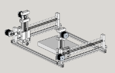
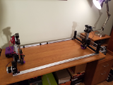
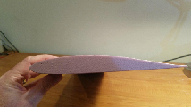

## Overview

The goal of this project was to build a relatively cheap CNC wing foam cutter using 3D printed parts,
and other components easily available online.  After looking at the alternatives out there, designing
a machine to use 3d printed parts, and other items readily available online seemed like a cheaper alternative.
This project is documented [here](https://github.com/c-devine/WingGcodeBuilder/wiki) on GitHub as well.

### Snapshots (click for larger image)

### Video

### Hardware
The axis pillars and carriages were designed in Sketchup, and 3D printed in PLA. All of the screws and bolts
are 3mm and 5mm hex bolts in order to keep the number of different sized to a minimum. The frame is made
out of 2020 20mm aluminum extrusions, and both the X and Y axis use 8mm smooth rods and LM8UU bearings.

BOM and other info can be found [here](https://github.com/c-devine/WingGcodeBuilder/wiki) on GitHub.

