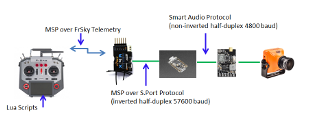

## Overview

The goal of this project was to write the firmware to allow a miniature controller device to enable the
use of Smart Audio on aircraft without needing a full blown FC running betaflight.  FPVWRA wings for example do not have
controller boards, but, do have FPV VTXs that may have Smart Audio capability.  An Adafruit trinket was
used as the controller board since it is cheap (< $9.00) and has a pretty powerful chip (SAMD21)
This project is documented [here](https://github.com/c-devine/AvrSmartAudio) on GitHub as well.

### Snapshots

### Video

### Software

Uses the Arduino C++ libraries, as well as some custom half-duplex software serial code, to handle both the inverted
and non-inverted serial protocols used by FrSky and SmartAudio.

### Hardware
AVR SAMD21.....

Firmware and other info can be found here [AvrSmartAudio](https://github.com/c-devine/AvrSmartAudio) on GitHub.

