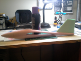

## Overview

Project used to capture and document the python scripts, software, and steps needed to go from models created in [XLFR5](http://www.xflr5.com/), exported to Blender,
for CAM and CNC file generation in Blender with BlenderCAM.

### Snapshots (click for larger image)

### Software
The python scripts used to import the body and wing files from the XFLR5 project files have been uploaded to
[RC Groups](https://www.rcgroups.com/forums/showthread.php?2295417-xflr5-Blender-Sketchup-CNC-Slope-Foamie-Project)
along with detailed step by step instructions.  CAM and NC file generation tips for BlenderCAM are also included.

